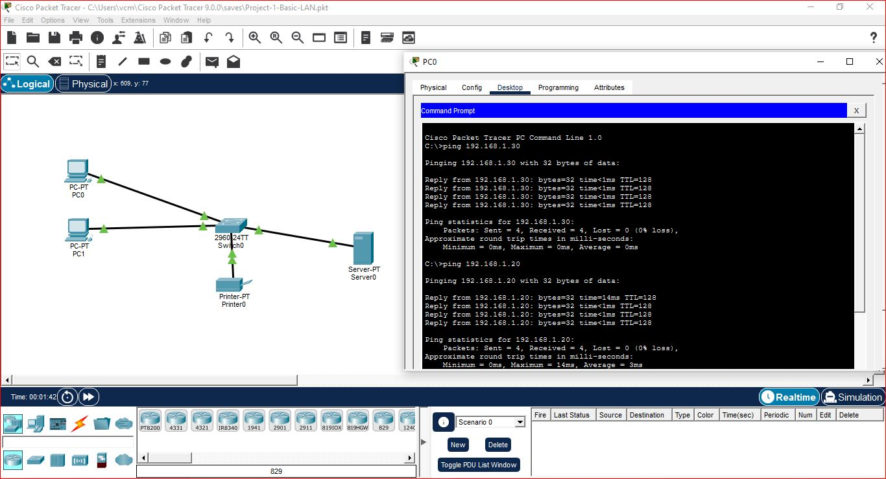

# Project 1 - Basic LAN Connectivity

## Objective

Build a basic Local Area Network (LAN) using a Cisco switch and two PCs, assign static IP addresses, and verify communication using the ping command.

---

## Network Topology



---

## Devices Used

- 1 × Cisco 2960 Switch
- 2 × PCs

---

## IP Addressing

| Device | IP Address | Subnet Mask |
|---------|------------|-------------|
| PC0 | 192.168.1.10 | 255.255.255.0 |
| PC1 | 192.168.1.11 | 255.255.255.0 |

---

## Configuration

### PC0

IP Address

192.168.1.10

Subnet Mask

255.255.255.0

---

### PC1

IP Address

192.168.1.11

Subnet Mask

255.255.255.0

---

## Verification

From PC0:

```cmd
ping 192.168.1.11
```

Expected Result:

```text
Reply from 192.168.1.11
```

---

## Skills Learned

- Basic LAN Setup
- Static IPv4 Addressing
- Cisco Packet Tracer
- Switch Connectivity
- Ping Testing
- Basic Network Troubleshooting

---

## Outcome

Successfully established communication between two hosts connected through a Cisco switch using static IPv4 addressing.
