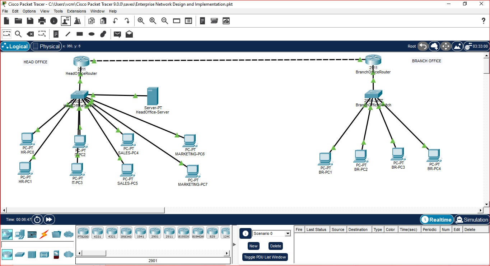

Enterprise Network Design and Implementation
Project Overview

Designed and implemented a multi-site enterprise network connecting a Head Office and a Branch Office using Cisco Packet Tracer. The project demonstrates VLAN segmentation, inter-VLAN routing, dynamic routing, centralized network services, and access control for secure communication.

Technologies Used
Cisco Packet Tracer
Cisco IOS
VLANs
Router-on-a-Stick
OSPF
DHCP
DNS
Extended ACL
Inter-VLAN Routing

Network Topology

Features
Multi-site Enterprise Network
Head Office & Branch Office Connectivity
VLAN Segmentation
Router-on-a-Stick
Dynamic Routing using OSPF
DHCP Server with DHCP Relay (ip helper-address)
Centralized DNS Server
Extended ACL for Department-Based Access Control
End-to-End Network Connectivity
Enterprise Network Troubleshooting
VLAN Configuration
VLAN	Department	Network
10	HR	192.168.10.0/24
20	IT	192.168.20.0/24
30	Sales	192.168.30.0/24
40	Marketing	192.168.40.0/24
60	Branch Office	192.168.60.0/24
Routing
Router-on-a-Stick configured using IEEE 802.1Q encapsulation.
OSPF Area 0 configured between Head Office and Branch Office.
Dynamic route exchange verified.
DHCP
Centralized DHCP Server
DHCP Pools for all VLANs
DHCP Relay configured using ip helper-address
DNS
Centralized DNS Server
Hostname resolution verified across VLANs
Security

Extended ACL configured with the following policy:

HR → Full Access
IT → Full Access
Sales → Cannot Access HR
Marketing → Cannot Access HR
Sales ↔ Marketing Allowed
Branch Office → Full Access
Verification

Verified using:

show ip interface brief
show ip route
show ip ospf neighbor
show vlan brief
show interfaces trunk
show access-lists
ping
ipconfig
Skills Demonstrated
Enterprise Network Design
Layer 2 Switching
VLAN Configuration
Inter-VLAN Routing
OSPF Dynamic Routing
DHCP & DHCP Relay
DNS Configuration
Extended ACL
Enterprise Network Troubleshooting
Cisco IOS CLI
